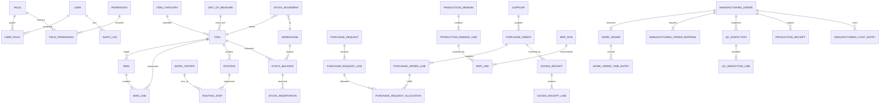

# Logical ERD

```mermaid
erDiagram
  USER ||--o{ USER_ROLE : assigned
  ROLE ||--o{ USER_ROLE : grants
  ROLE ||--o{ ROLE_PERMISSION : contains
  PERMISSION ||--o{ ROLE_PERMISSION : included
  USER ||--o{ AUDIT_LOG : acts
  ITEM_CATEGORY ||--o{ ITEM : classifies
  UNIT_OF_MEASURE ||--o{ ITEM : base_unit
  ITEM ||--o{ BOM : output
  BOM ||--|{ BOM_LINE : contains
  ITEM ||--o{ BOM_LINE : component
  ITEM ||--o{ ROUTING : product
  ROUTING ||--|{ ROUTING_STEP : sequences
  WORK_CENTER ||--o{ ROUTING_STEP : runs_at
  SUPPLIER ||--o{ PURCHASE_ORDER : supplies
  PURCHASE_REQUEST ||--|{ PURCHASE_REQUEST_LINE : contains
  PURCHASE_ORDER ||--|{ PURCHASE_ORDER_LINE : contains
  PURCHASE_REQUEST_LINE ||--o{ PURCHASE_REQUEST_ALLOCATION : allocated
  PURCHASE_ORDER_LINE ||--o{ PURCHASE_REQUEST_ALLOCATION : fulfills
  PURCHASE_ORDER ||--o{ GOODS_RECEIPT : received_by
  GOODS_RECEIPT ||--|{ GOODS_RECEIPT_LINE : contains
  ITEM ||--o{ STOCK_BALANCE : balanced
  WAREHOUSE ||--o{ STOCK_BALANCE : located
  STOCK_BALANCE ||--o{ STOCK_RESERVATION : reserved
  STOCK_MOVEMENT }o--|| ITEM : moves
  STOCK_MOVEMENT }o--|| WAREHOUSE : at
  PRODUCTION_DEMAND ||--|{ PRODUCTION_DEMAND_LINE : contains
  MRP_RUN ||--|{ MRP_LINE : recommends
  PRODUCTION_DEMAND_LINE ||--o{ MRP_LINE : planned_for
  MANUFACTURING_ORDER ||--|{ WORK_ORDER : executes
  MANUFACTURING_ORDER ||--|{ MANUFACTURING_ORDER_MATERIAL : requires
  WORK_ORDER ||--o{ WORK_ORDER_TIME_ENTRY : records
  MANUFACTURING_ORDER ||--o{ QC_INSPECTION : inspected
  QC_INSPECTION ||--|{ QC_INSPECTION_LINE : classifies
  MANUFACTURING_ORDER ||--o{ PRODUCTION_RECEIPT : outputs
  MANUFACTURING_ORDER ||--o{ MANUFACTURING_COST_ENTRY : costs
```

The ERD is logical, not an assertion that all listed tables already exist in the implementation. Physical schema and migration status are tracked in `PROGRESS.md`.
